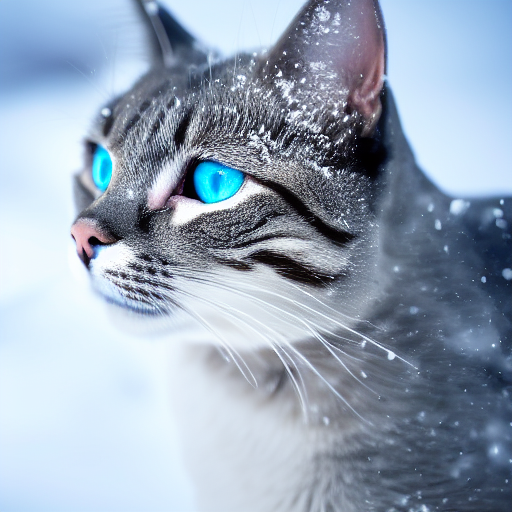
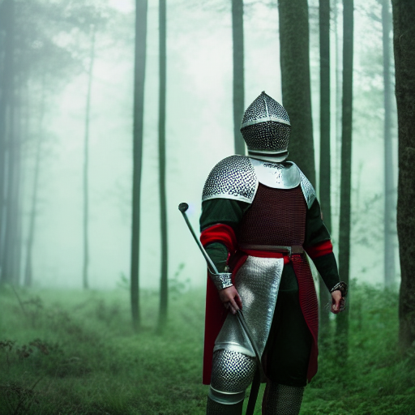
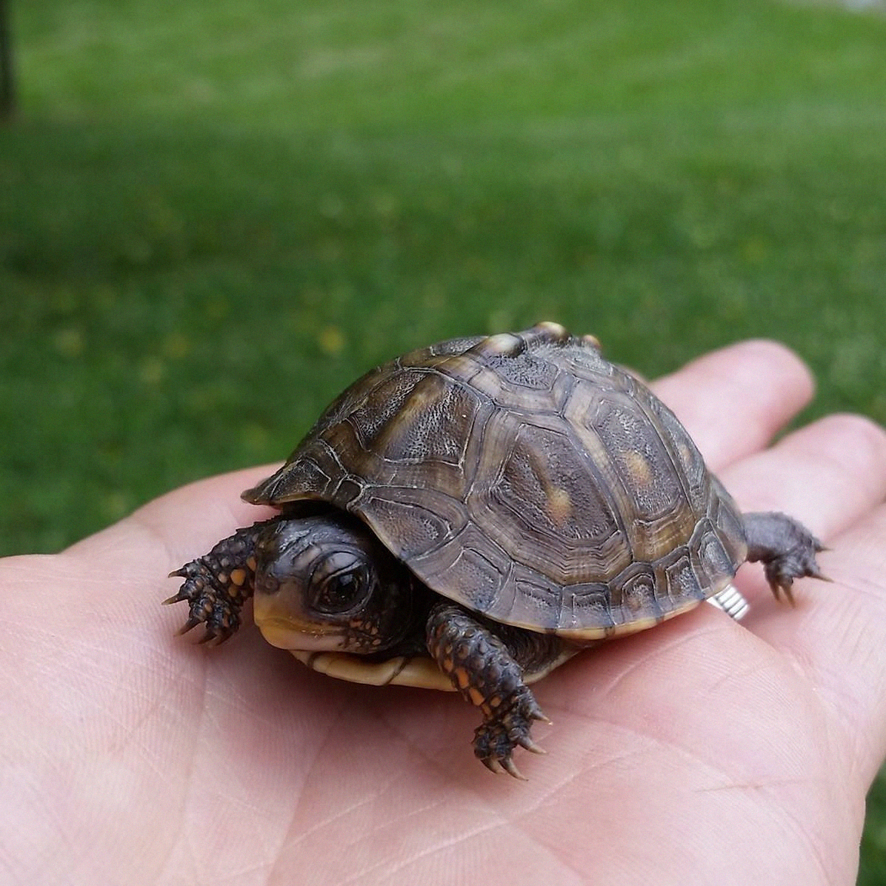
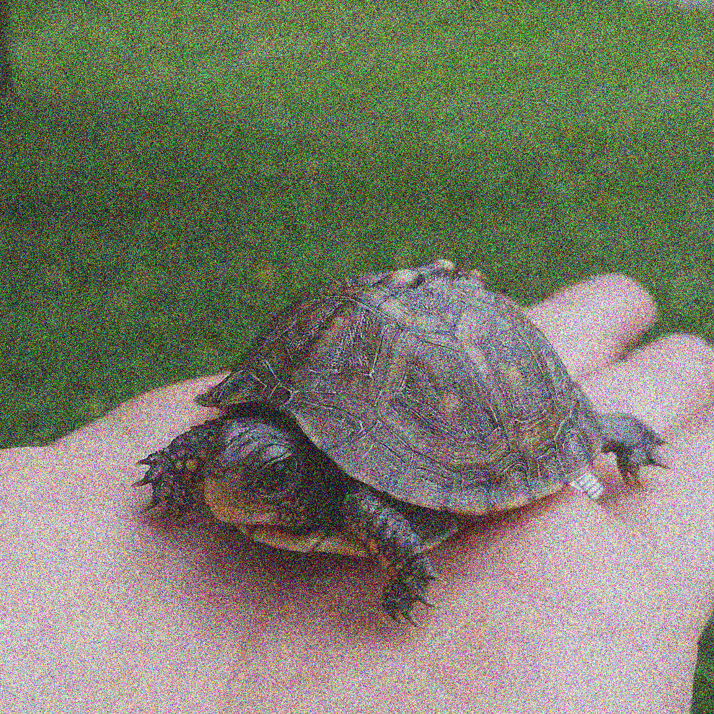

# stable-diffusion-pytorch


Personal implementation of Stable Diffusion in PyTorch from scratch. Educational and research purposes only.

<table align="center">
  <tr>
    <td style="text-align:center;">prompt = "A cat under the snow with blue eyes, covered by snow, highly detailed, realistic, ultra sharp, cinematic, 100mm lens, 8k resolution."</td>
    <td style="text-align:center;"></td>
  </tr>
</table>

## Text to Image
<table align="center">
  <tr>
    <td style="text-align:center;"></td>
    <td style="text-align:center;"></td>
    <td style="text-align:center;"></td>
    <td style="text-align:center;"></td>
  </tr>
</table>

## Image to Image
<table align="center">
  <tr>
    <td style="text-align:center;"></td>
    <td style="text-align:center;"></td>
    <td style="text-align:center;"></td>
    <td style="text-align:center;"></td>
  </tr>
</table>

## Getting started

1. **Create a Conda environment:**

    ```sh
    conda create -n sd-env python=3.11
    conda activate sd-env
    ```

2. **Clone the repository:**

    ```sh
    git clone https://github.com/martintomov/stable-diffusion-pytorch.git
    cd stable-diffusion-pytorch
    ```

3. **Install the required packages:**

    ```sh
    pip install -r requirements.txt
    ```

4. **Download weights:**

    Download `v1-5-pruned-emaonly.ckpt` (4.27 GB) from [RunwayML on Hugging Face](https://huggingface.co/runwayml/stable-diffusion-v1-5/tree/main) and save it in the `/data` folder. Feel free to download any other weights you like.

5. **Run the demo:**

    You can run the demo via `demo.py` or `demo.ipynb` notebook by your preference. Both demo scripts are configured to use a MPS GPU device, which can be easily adjusted at the start of the code file.

    ```sh
    # To run the demo script
    python demo.py

    # Or open and run the Jupyter notebook
    jupyter notebook demo.ipynb
    ```

## Dependencies

- PyTorch
- Numpy
- tqdm
- Pillow
- transformers
- lightning
- ipykernel

## Happy experimenting! 🚀
